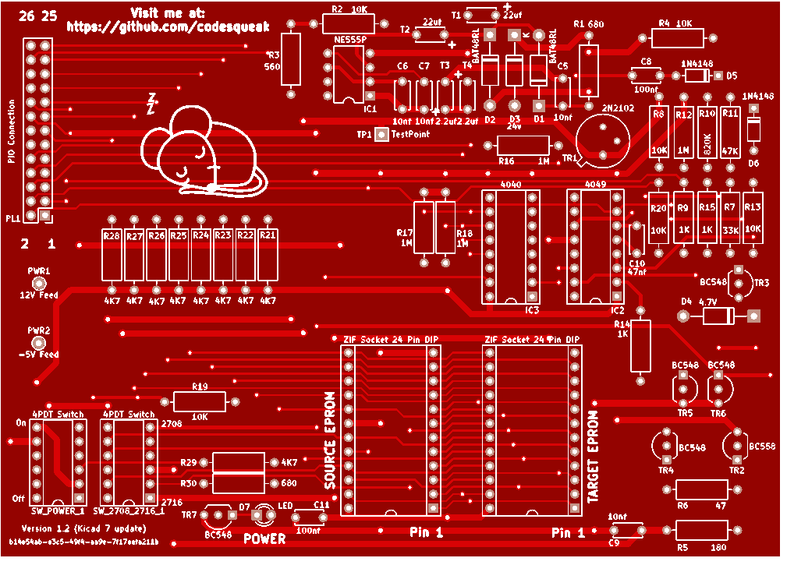

# EPROM-Programmer

2708 / 2716 Simple EPROM Programmer

## Introduction

This card has been designed to be a functional replacement for the Bits & PCs Nascom EPROM Programmer.  It is fully compatible with the existing software.

The card is a completely new implementation of the design with a number of improvements over the original:

*	Completely new track layout
*	All components are readily available from commercial component suppliers (..and eBay!)
*	Switches are fitted to standard 12 PIN DIL sockets
*	LED power indicator
*	Power test point

For full documentation, see the [New EPROM Programmer card.pdf](New EPROM Programmer card.pdf).  

 
